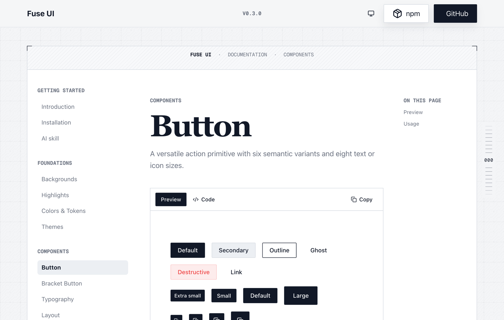

# Fuse UI

[](https://github.com/EgorYolkin/fuse-ui/actions/workflows/ci.yml)
[](https://www.npmjs.com/package/@egoryolkin/fuse-ui)
[](LICENSE)

A reusable React UI kit with a technical, editorial visual language: sharp controls, fine borders, registration corners, layered panels, monospace metadata, and restrained motion.

[](https://fuse-ui.egoryolkin.ru/components/button)

*Button variants and sizes — open the image for the interactive component preview.*

> **Documentation:** explore every component, live UI examples, and usage guidance at **[fuse-ui.egoryolkin.ru](https://fuse-ui.egoryolkin.ru)**.
>
> **Changes:** see the current release notes in **[CHANGELOG.md](CHANGELOG.md)** or open **Project / Changelog** in Storybook.

## Features

- Typed React components published as ESM
- One opt-in stylesheet with light and dark semantic tokens
- Accessible primitives built on Base UI
- Reduced-motion support for non-essential animation
- Tree-shakeable JavaScript and explicit package exports
- npm Trusted Publishing with provenance

## Installation

```bash
npm install @egoryolkin/fuse-ui
```

Fuse UI supports React and React DOM 19.x. Import the shared stylesheet once in your application entry point:

```tsx
import "@egoryolkin/fuse-ui/styles.css"
```

Geist is an optional peer dependency. Install and import it if you want the intended typography:

```bash
npm install @fontsource-variable/geist
```

```tsx
import "@fontsource-variable/geist"
```

## Quick start

```tsx
import {
  BracketButton,
  CornerBox,
  Heading,
  Text,
} from "@egoryolkin/fuse-ui"
import "@egoryolkin/fuse-ui/styles.css"

export function Hero() {
  return (
    <CornerBox full className="border border-border bg-surface p-8">
      <Heading>Build useful things.</Heading>
      <Text className="mt-3">A reusable Fuse UI surface.</Text>
      <BracketButton
        className="mt-6"
        href="https://fuse-ui.egoryolkin.ru"
        variant="primary"
      >
        Open documentation
      </BracketButton>
    </CornerBox>
  )
}
```

Add `className="dark"` (or `class="dark"` outside React) to an application root to enable the dark theme manually.

## Component workbench

Run Storybook to develop and test components in isolation:

```bash
npm run storybook
```

Open `http://localhost:6006`. Stories cover component variants, light and dark themes, accessibility checks, and interaction scenarios. Build the static Storybook with:

```bash
npm run build-storybook
```

## UI examples

Compose the primitives into product surfaces; Fuse UI supplies the visual language while your application owns the layout and content.

```tsx
import {
  Badge,
  BracketButton,
  CornerBox,
  Heading,
  Text,
} from "@egoryolkin/fuse-ui"

export function ReleaseCard() {
  return (
    <CornerBox full className="border border-border bg-surface p-6">
      <Badge variant="outline">v0.3.0</Badge>
      <Heading className="mt-4">Ready to ship</Heading>
      <Text className="mt-2 text-muted-foreground">
        Accessible controls and semantic tokens, ready for your application.
      </Text>
      <BracketButton
        className="mt-6"
        href="https://fuse-ui.egoryolkin.ru"
        variant="primary"
      >
        Browse component examples
      </BracketButton>
    </CornerBox>
  )
}
```

For more compositions, theme states, and component APIs, visit **[fuse-ui.egoryolkin.ru](https://fuse-ui.egoryolkin.ru)**.

### Theme provider

Use `ThemeProvider` for persisted light, dark, and system modes. It updates the root `<html>` class, follows changes to `prefers-color-scheme`, and injects a small SSR-safe initialization script to avoid a theme flash:

```tsx
import { ThemeProvider, ThemeToggle } from "@egoryolkin/fuse-ui"

export function App() {
  return (
    <ThemeProvider defaultTheme="system" storageKey="app-theme">
      <ThemeToggle showLabel />
      {/* application */}
    </ThemeProvider>
  )
}
```

`useTheme()` returns `{ theme, resolvedTheme, setTheme }` for custom controls. The included `ThemeToggle` cycles through light, dark, and system modes. Pass `nonce` to `ThemeProvider` when your Content Security Policy requires one.

## Components

Complete props, live previews, and implementation examples are available at **[fuse-ui.egoryolkin.ru](https://fuse-ui.egoryolkin.ru)**.

| Area | Exports |
| --- | --- |
| Layout | `Container`, `Stack`, `Cluster`, `Grid`, `Navbar`, `Footer` |
| Typography | `Heading`, `Text`, `Kicker`, `Highlight`, `HighlightHeading`, `SectionHeading` |
| Actions and inputs | `Button`, `BracketButton`, `Checkbox`, `Combobox`, `Switcher`, `Switch`, `ThemeToggle` |
| Navigation | `Accordion`, `Breadcrumb`, `Carousel`, `Pagination`, `Tabs`, `TabsList`, `TabsTrigger`, `TabsContent` |
| Overlays and feedback | `Dialog`, `ToastProvider`, `useToast`, `Skeleton`, `Spinner` |
| Surfaces and data | `Alert`, `Avatar`, `AvatarGroup`, `Badge`, `Calendar`, `CornerBox`, `DataTable`, `PatternStrip`, `Separator`, `IconTile`, `IconList`, `StackedPanel`, `StaggeredList` |
| Code | `Code`, `CodeBlock` |
| Motion | `Marquee`, `ScrollCrown` |
| Theme | `ThemeProvider`, `ThemeToggle`, `useTheme` |

The Combobox export includes styled input, trigger, popup, list, item, indicator, group, empty-state, clear, and portal helpers. Stacked panels and staggered lists expose their corresponding content/item helpers. Buttons and badges share `default`, `outline`, `ghost`, and `destructive` visual variants.

`CodeBlock` applies Fuse UI syntax colors to highlighted source and includes a copy button. It also supports optional line numbers:

```tsx
import { CodeBlock } from "@egoryolkin/fuse-ui"

<CodeBlock
  language="tsx"
  showLineNumbers
  code={`export function SaveButton() {\n  return <Button>Save</Button>\n}`}
/>
```

Inline `<code>` elements receive the same technical surface treatment from the shared stylesheet.

All component props are exported through the generated TypeScript declarations and extend the relevant native or Base UI props where appropriate.

## Styling and theming

Fuse UI ships compiled Tailwind CSS, so consumers do not need to configure Tailwind or scan this package. The stylesheet defines semantic tokens such as `--background`, `--foreground`, `--surface`, `--border`, `--primary`, and `--muted-foreground` for both default and `.dark` themes.

Load the stylesheet before application overrides. Override semantic custom properties at your application root rather than targeting component internals:

```css
:root {
  --primary: oklch(0.55 0.18 250);
}
```

The exact token set is available in [`src/styles.css`](src/styles.css). CSS is marked as a package side effect so bundlers retain explicit stylesheet imports.

## Accessibility

Components use semantic elements and accessible Base UI primitives where applicable. Motion responds to `prefers-reduced-motion`. Consumers remain responsible for meaningful labels, focus order, color contrast after token overrides, and testing complete application flows with a keyboard and assistive technology.

Interactive components use React client APIs. In React Server Component frameworks, render them behind the framework's client boundary.

## Development

For consumer documentation, always start at **[fuse-ui.egoryolkin.ru](https://fuse-ui.egoryolkin.ru)**.

Development requires Node.js 22.12 or newer and the npm version declared in `package.json`.

```bash
npm ci
npm run check
npm run test:package
```

The production package is generated in `dist/`. See [CONTRIBUTING.md](CONTRIBUTING.md) before submitting a change.

## Releases and support

- Changes follow [Semantic Versioning](https://semver.org/) and are recorded in [CHANGELOG.md](CHANGELOG.md).
- Maintainer release steps are documented in [RELEASING.md](RELEASING.md).
- For usage help and bugs, see [SUPPORT.md](SUPPORT.md).
- Report vulnerabilities privately according to [SECURITY.md](SECURITY.md).
- Community participation is governed by the [Code of Conduct](CODE_OF_CONDUCT.md).

## License

[MIT](LICENSE) © Egor Yolkin
